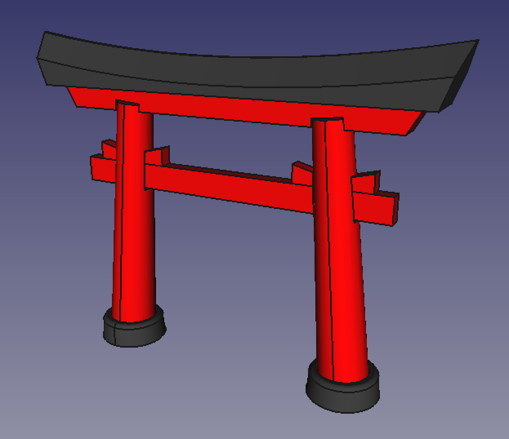
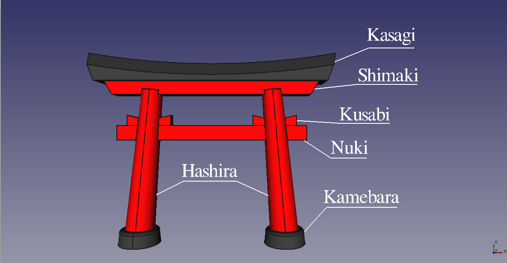

# Japanese Torii

Parametric Japanese :jp: Torii (鳥居) created in Freecad designed for 3D printing.



## Description

This repository contains the source files of a 3D model of a Japanese Torii.

I created the 3D model using a 3D modeling tool called [FreeCAD](http://freecadweb.org). This is a fantastic tool that we all should contribute to improve!

If you want to know more about Japanese Toriis please check out the [Wikipedia Article about a Japanese Torii](https://en.wikipedia.org/wiki/Torii).

I took the Japanese names from that article:



I wasn't trying to be very purist in following the real design so please don't be offended by its inaccuracy :sweat_smile:. This is open source so instead of complaining please [contribute](#contribute). :thumbsup: 

## Clonning :sheep:

In order to clone this project you can run the following command:

```bash
$ git clone https://github.com/rafadesu/japanesetorii
```

## Adjusting Clearance :triangular_ruler:

The parts that form this Torii are meant to fit into each other. The manufactoring process requires of certain clearance for your 3D parts to fit properly.

I created this model so that the clearance can be easily adjusted by running a python script.

Please checkout the following Youtube video for instructions on how to do it: (TODO: Add video link)

## 3D Printing

I've already generated a mesh file containing all the parts of the Torii oriented in the best way possible to print in my [Prusa i3](http://reprap.org/wiki/Prusa_i3) with a clearance of 0.5mm.

If you want to print it in two different materials (red and black) you will have to print each part separatly.

* [Kasagi](stl/Kasagi.stl)
* [Kusabi](stl/Kusabi.stl)
* [Hashira](stl/Torii.stl)
* [Nuki](stl/Nuki.stl)
* [Kamebara](stl/Kamebara.stl)
* [Shimaki](stl/Shimaki.stl)

Or you can just print it all in red and then paint the black parts:

* [All parts at once](stl/Torii.stl)

**Note: Ensure that you print each part oriented the suggested way for better results unless you know what you are doing.**

## Contribute

I'm a newbie in FreeCAD so maybe there are better ways of doing what I intended. So please, feel free to branch the project and modify it.

There are other parts of a Torii that I didn't include in the model that can be added so if you feel you can do better or add new things please go ahead!i Thanks! :v:

If you want to upload proof of having printed this in your 3D printer please go ahead and do it in the [Makes](Makes/) folder.

